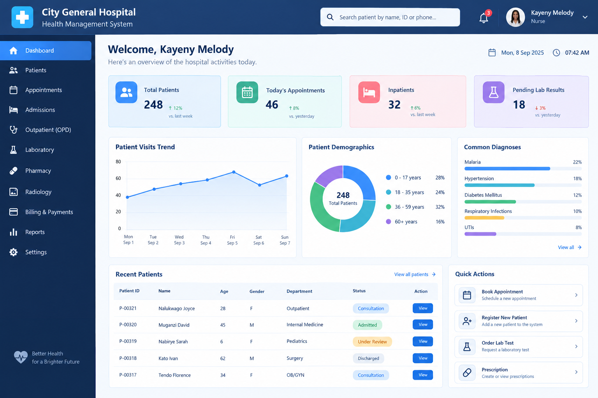

# Exploring Object-Oriented Programming in Real-World Health Applications.
## Introduction
Python is a commonly used programming language[1]. It is used for data analysis, machine learning, web development, task automation and software testing[2].
In object-oriented programming with python, code is organized into objects under a class with actions that operate on that data. Encapsulation, abstraction, inheritance and polymorphism are the four pillars of object oriented programming[3]. Encapsulation involves building attributes and methods that operate on the data together within a class while restricting direct access to them[4]. Abstraction involves hiding of complex implementation features and only exposing the user friendly features to users[5]. Inheritance allows a new class(child) to adopt methods and attributes of an existing class(parent)[4]. Polymorphism allows different classes to utilize the same method name but execute different actions based on the object type[4].
The healthcare sector uses software extensively in research, data analysis, imaging, laboratory information systems, hospital management systems and pharmacy management among others[6].
## Body
Python can be used  to build relevant software in the health sector. For example, one that carries out predictive analysis of patients records to be able to predict the risk and prognosis of a patient aids in efficient healthcare delivery and reduces upon the morbidity and mortality rates[6]
The applications of object oriented programming in health care are robust. For example, encapsulation is used to keep patients’ information’ private  and to ensure confidentiality which is congruent with data privacy laws. It then customizes the information available for each staff in the hospital for example the lab technologist will not be able to access the patients list of drugs and the receptionist will only be able to access patient appointment information among others. An example of this is as follows; 
```
Class Patient:
     def __init__(self, name, patient_id, medical_history, medication):
        self.__name = name
        self.__patient_id = patient_id
        self.__medical_history = medical_history
        self.__medication = medication
 
    def get_name(self):
        return self.__name
    def get_patient_id(self):
        return self.__patient_id
    def get_medical_history(self):
        return self.__medical_history
    def get_medication(self,role):     #gazetting medication access to the doctor
          if role==’’doctor’’:
                return self.medication
           else:
                return ‘’ACCESS DENIED’’
        return self.__medication
class Staff:
     def_init_(self,name,role):
          self.name=name
           self.role=role
```
 

Electronic health records, laboratory health systems and pharmacy management systems used in hospitals are used by people with little to no  knowledge of programming. Through abstraction, a user-friendly interface is created for each health worker to be able to update and retrieve patient information and inventory.  Behind the interface are multiple lines of code. The AI generated image below shows an example of a user interface.



 
In regards to the concept of inheritance in object oriented programming a new class acquires the properties and behaviors of an existing class for example,   medical records can have ‘child’ classes with patients’ vitals records, radiological records, laboratory records, surgical procedures done and medication records[6]. An example is shown below;
```
class  MedicalRecords:    #parent
      def_init_(self,name):
      self.name=name
 class LabRecords(MedicalRecords):    #child
       def_init_(self,name,cbc,rft):
          super()._init_(name)
           self.cbc=cbc
           self.rft=rft
```

Polymorphism can be applied in healthcare through the triage process. Triage is a term used to refer to the categorization of patients in regards to their medical need[7]. It enables health workers give the most ill patients priority over those that are more stable. Patients can them be admitted and be referred to as in-patient, out-patient, critical or requiring emergency care. An example is shown below;
```
class Triage:
  def severity(self):
    pass
class Inpatient(Triage):
    def severity(self):
      return ‘’admit’’
```

## Conclusion
Python needs to be embedded more into health systems since it improves upon efficiency of health service delivery and reduces morbidity and mortality rates overtime.
## REFERRENCES
1. [1]	“PYTHON PROGRAMMING III YEAR/II SEM MRCET PYTHON PROGRAMMING [R17A0554] LECTURE NOTES.”
2. [2]	M. Urmila Chavan, “Python in Real-World”.
3. [3]	“Understanding Object-Oriented Programming (OOP): A Comprehensive Guide.” [Online]. Available: https://www.researchgate.net/publication/379507883_Harnessing_the_Power_of_
4. [4]	“382192.383004”.
5. [5]	A. Rahnev, N. Pavlov, N. Valchanov, and T. Terzieva, Object Oriented Programming. 
6. [6]	TatvaSoft, “Python in healthcare: A complete guide,” 2026.
7. [7]	“16_6_2010_0690_0698”.
 

